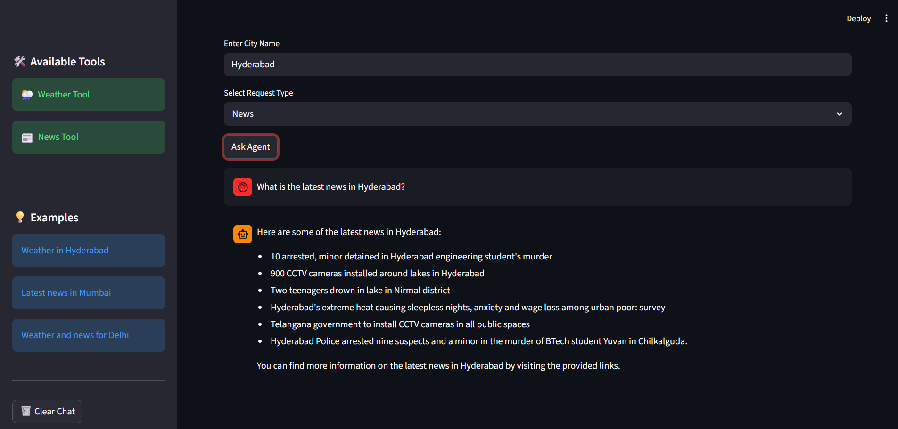

# AI City Assistant
An AI-powered City Assistant built using **LangChain**, **Groq LLMs**, **Tavily Search API**, **OpenWeather API**, and **Streamlit**.
Ask about any city and get real-time weather updates and latest news through an AI agent with dynamic tool-calling.

---

## Visual Workflow


---

## 📸 Screenshots

### Home Interface


### Request Types


### News Response


---

## ✨ Features
- 🌦️ Real-time weather using OpenWeather API
- 📰 Latest city news using Tavily Search
- 🤖 AI Agent with dynamic tool-calling — routes queries intelligently
- ⚡ Fast inference using Groq (Llama 3.3 70B)
- 💬 Streamlit chat interface with history
- 🧠 LangChain AgentExecutor workflow

---

## 🛠️ Tech Stack
- Python 3.11
- Streamlit
- LangChain
- Groq API (Llama 3.3 70B)
- Tavily Search API
- OpenWeather API

---

## 📂 Project Structure
```text
ai-city-assistant/
│
├── assets/
│   ├── ai-city.png
│   ├── demo1.png
│   ├── demo2.png
│   └── demo3.png
│
├── .env.example
├── app.py
├── runtime.txt
├── requirements.txt
└── README.md
```

---

## ⚙️ Installation

### 1️⃣ Clone the Repository
```bash
git clone https://github.com/bangarukondabollapally/ai-city-assistant.git
cd ai-city-assistant
```

### 2️⃣ Create Virtual Environment
```bash
python -m venv .venv
```

Activate:

#### Windows
```bash
.venv\Scripts\activate
```

#### Mac/Linux
```bash
source .venv/bin/activate
```

### 3️⃣ Install Dependencies
```bash
pip install -r requirements.txt
```

---

## 🔑 Environment Variables
Create a `.env` file and add:
```env
GROQ_API_KEY=your_groq_api_key
OPENWEATHER_API_KEY=your_openweather_api_key
TAVILY_API_KEY=your_tavily_api_key
```

Get your free API keys at:
- [console.groq.com](https://console.groq.com)
- [openweathermap.org](https://openweathermap.org/api)
- [tavily.com](https://tavily.com)

---

## ▶️ Run the Application
```bash
streamlit run app.py
```

---

## 💡 Example Queries
- What's the weather in Hyderabad?
- Latest news in Mumbai
- Weather and news for Delhi
- Weather in New York

---

## 📦 requirements.txt
```text
streamlit
langchain
langchain-groq
tavily-python
requests
```

---

## 🔮 Future Improvements
- 🌍 Multi-language support
- 📈 Weather forecasting (5-day outlook)
- 🧠 Memory-enabled agents for follow-up queries
- 🗺️ Maps integration
