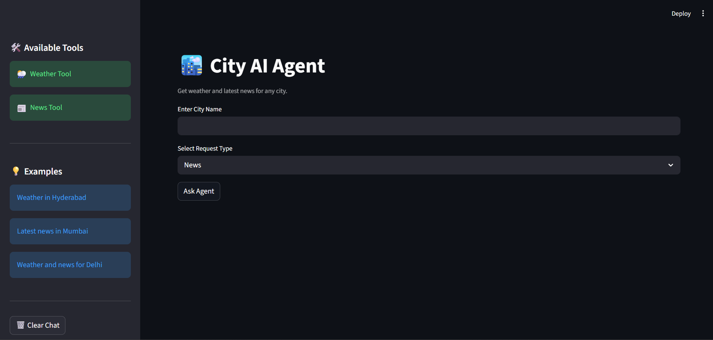
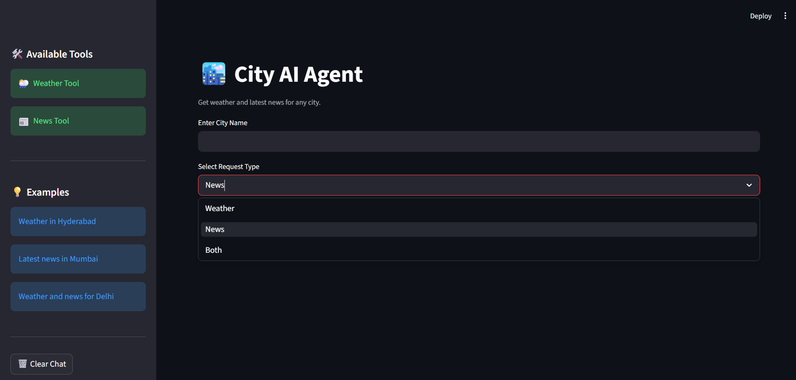

# AI City Assistant

An AI-powered City Assistant built using **LangChain**, **Groq LLMs**, **Tavily Search API**, and **Streamlit**.

This application provides:
- 🌦️ Real-time weather updates
- 📰 Latest city news
- 🤖 AI agent-based responses using LangChain tools
- 💬 Interactive chat-style interface

---

## 📸 Screenshots

### Home Interface



---

### Request Types



---

### News Response


---

## ✨ Features

- 🌦️ Real-time weather using OpenWeather API
- 📰 Latest city news using Tavily Search
- 🤖 AI Agent with tool-calling support
- ⚡ Fast inference using Groq
- 💬 Streamlit chat interface
- 🧠 LangChain agent workflow

---

## 🛠️ Tech Stack

- Python
- Streamlit
- LangChain
- Groq API
- Tavily API
- OpenWeather API

---

## 📂 Project Structure

```text
ai-city-assistant/
│
├── screenshots/
│   ├── demo1.png
│   ├── demo2.png
│   └── demo3.png
│
├── .env.example
├── app.py
├── requirements.txt
└── README.md
```

---

## ⚙️ Installation

### 1️⃣ Clone the Repository

```bash
git clone https://github.com/bangarukondabollapally/ai-city-assistant.git
```

```bash
cd ai-city-assistant
```

---

### 2️⃣ Create Virtual Environment

```bash
python -m venv .venv
```

Activate environment:

#### Windows

```bash
.venv\Scripts\activate
```

#### Mac/Linux

```bash
source .venv/bin/activate
```

---

### 3️⃣ Install Dependencies

```bash
pip install -r requirements.txt
```

---

## 🔑 Environment Variables

Create a `.env` file and add:

```env
GROQ_API_KEY=your_groq_api_key

OPENWEATHER_API_KEY=your_openweather_api_key

TAVILY_API_KEY=your_tavily_api_key
```

---

## ▶️ Run the Application

```bash
streamlit run app.py
```

---

## 💡 Example Queries

- What's the weather in Hyderabad?
- Latest news in Mumbai
- Weather and news for Delhi
- Weather in New York

---

## 📦 Requirements

Main dependencies:

```text
streamlit
langchain
langchain-groq
tavily-python
python-dotenv
requests
```

---

## 🚀 Deployment Note

This project requires 3 external API keys and is best 
run locally. See installation steps above to get started.

---

## 🔮 Future Improvements

- 🌍 Multi-language support
- 📈 Weather forecasting
- 🧠 Memory-enabled agents
- 📱 Improved mobile responsiveness
- 🗺️ Maps integration